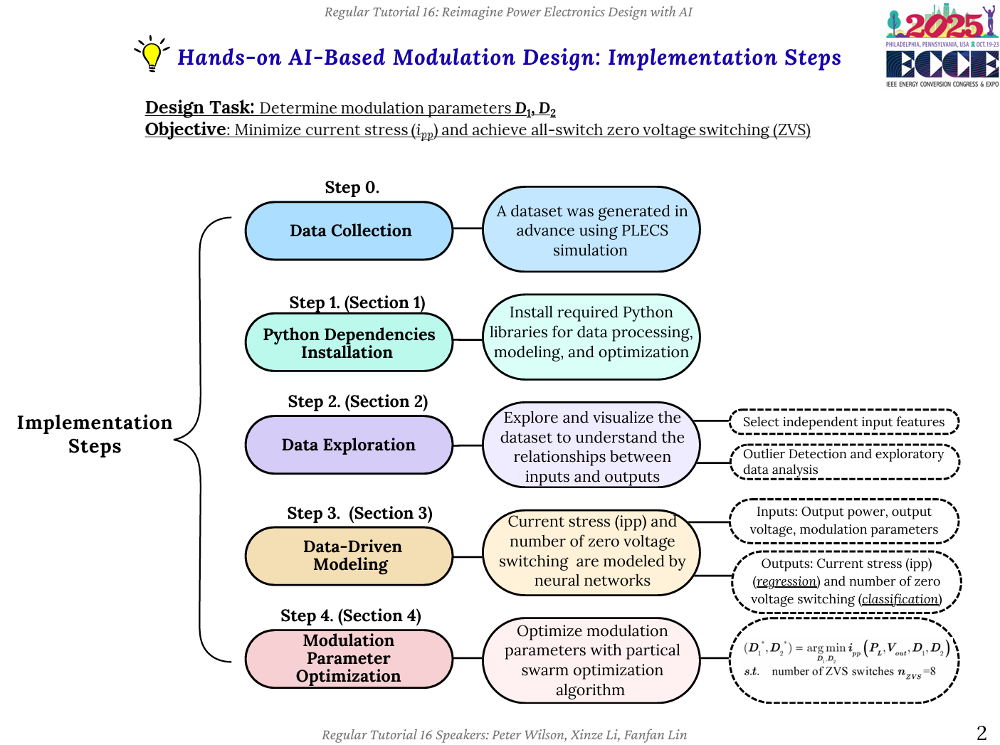

# ECCE2025

* Open the tutorial in Google Colab:<br>
<a href="https://colab.research.google.com/github/xinzelee/ECCE2025/blob/main/ECCE2025_tutorial_colab.ipynb" target="_blank">
  
</a>
<br><br>

## Description
<p align="center">
  <br>
  
</p>

## Code Author
@code-author: <br>
* Xinze Li (email: xinzeli831@gmail.com)

<br><br>
## License

This code is licensed under the [Apache License Version 2.0](./LICENSE).

<br><br>
## Citation

If you use this repository in your research or project, please cite the following paper:

```
F. Lin, X. Zhang, X. Li, C. Sun, W. Cai and Z. Zhang, 
"Automatic Triple Phase-Shift Modulation for DAB Converter With Minimized Power Loss," 
IEEE Transactions on Industry Applications, vol. 58, no. 3, pp. 3840-3851, May-June 2022, 
doi: 10.1109/TIA.2021.3136501.

```